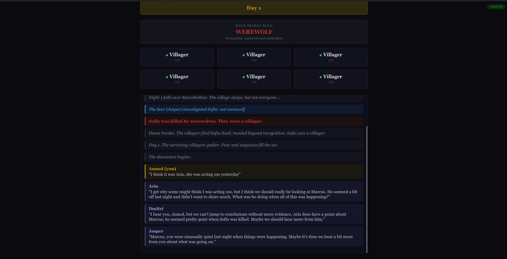
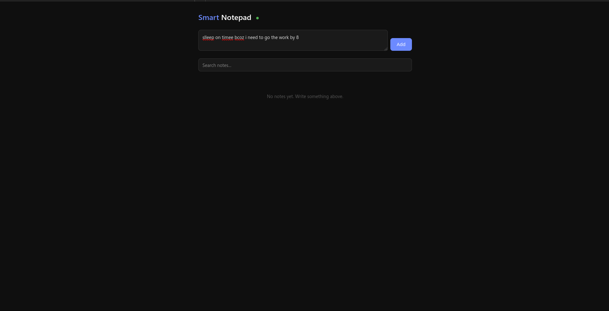
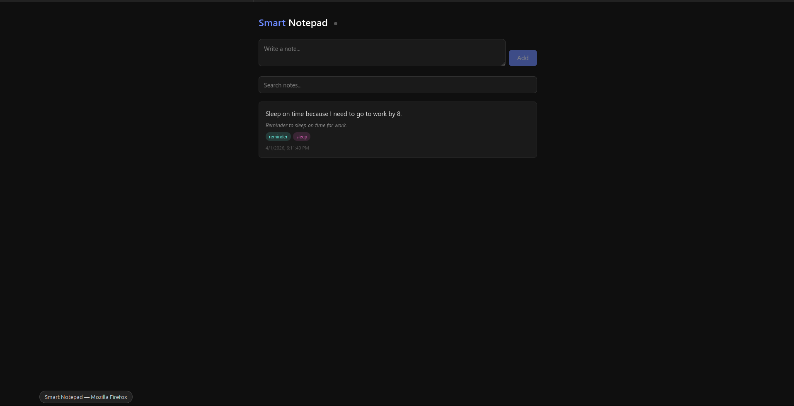

# InteractKit

**TypeScript framework for composable, multi-agent AI systems.**

Define your entity graph in XML. Write tool handlers in TypeScript. The CLI compiles everything into a fully typed runtime.

```bash
npm i -g @interactkit/cli
interactkit init my-app
cd my-app && npm install && npx interactkit dev
```

---

## Quick Example

**`interactkit/entities.xml`** -- define the entity graph:

```xml
<?xml version="1.0" encoding="UTF-8"?>
<graph xmlns="https://interactkit.dev/schema/v1" version="1" root="Agent">

  <entity name="Agent" type="base" description="Agent with brain and memory">
    <components>
      <component name="brain" entity="Brain" />
      <component name="memory" entity="Memory" />
    </components>
    <state>
      <field name="count" type="number" description="Request count" default="0" />
    </state>
    <tools>
      <tool name="ask" description="Ask a question" src="tools/ask.ts">
        <input><param name="question" type="string" /></input>
        <output type="string" />
      </tool>
    </tools>
  </entity>

  <entity name="Brain" type="llm" description="LLM-powered reasoning">
    <executor provider="openai" model="gpt-4o-mini" />
    <tools>
      <tool name="think" description="Think about something" peerVisible="true">
        <input><param name="query" type="string" /></input>
        <output type="string" />
      </tool>
    </tools>
  </entity>

  <entity name="Memory" type="long-term-memory" description="Semantic memory" />

</graph>
```

**`interactkit/tools/ask.ts`** -- typed tool handler:

```typescript
import type { AgentEntity, AgentAskInput } from '../.generated/types.js';

export default async (entity: AgentEntity, input: AgentAskInput): Promise<string> => {
  entity.state.count++;
  const answer = await entity.components.brain.think({ query: input.question });
  await entity.components.memory.store({ text: `Q: ${input.question} A: ${answer}` });
  return answer;
};
```

**`src/app.ts`** -- boot and serve:

```typescript
import { graph } from '../interactkit/.generated/graph.js';
import { ChromaDBVectorStoreAdapter } from '@interactkit/chromadb';

const app = graph.configure({
  database: db,
  vectorStore: new ChromaDBVectorStoreAdapter({ collection: 'memory' }),
});

await app.boot();
await app.serve({ http: 3000 });
```

Run `interactkit compile` and everything gets full type safety -- entity state, components, inputs, outputs.

---

## Getting Started

```bash
interactkit init my-app        # scaffold project
cd my-app && npm install
npx interactkit dev            # compile + run + watch
```

This creates:

```
my-app/
  interactkit/
    entities.xml               # entity graph definition
    tools/                     # tool handler files
    .generated/                # auto-generated (gitignored)
  src/
    app.ts                     # boot + serve
  package.json
  tsconfig.json
```

---

## Core Concepts

### Entities

Everything is an entity. Entities have state, tools, components (children), refs (siblings), and streams.

```xml
<entity name="Sensor" type="base" description="Temperature sensor">
  <describe>Sensor "{{label}}" -- {{readingCount}} readings</describe>
  <state>
    <field name="label" type="string" description="Sensor label" default="temperature"
           configurable="true" configurable-label="Label" />
    <field name="readingCount" type="number" description="Total readings" default="0" />
  </state>
  <streams>
    <stream name="readings" type="number" description="Sensor readings stream" />
  </streams>
  <tools>
    <tool name="read" description="Take a reading" peerVisible="true" src="tools/read-sensor.ts">
      <input />
      <output type="number" />
    </tool>
  </tools>
</entity>
```

### Tools

Tools are methods on entities. Point `src` to a TypeScript handler file:

```xml
<tool name="speak" description="Speak a message" src="tools/speak.ts">
  <input><param name="message" type="string" /></input>
  <output type="void" />
</tool>
```

```typescript
// interactkit/tools/speak.ts
import type { MouthEntity, MouthSpeakInput } from '../.generated/types.js';

export default async (entity: MouthEntity, input: MouthSpeakInput): Promise<void> => {
  entity.state.history.push({ message: input.message });
  entity.streams.transcript.emit(input.message);
};
```

Handlers receive a fully typed `entity` with `.state`, `.components`, `.refs`, and `.streams`.

### Autotools

Zero-code CRUD on fieldGroups. No handler file needed.

```xml
<state>
  <fieldGroup name="entries" key="id">
    <field name="text" type="string" description="Entry content" />
  </fieldGroup>
</state>
<tools>
  <autotool name="store" on="entries" op="create" peerVisible="true" />
  <autotool name="search" on="entries" op="search" key="query" peerVisible="true" />
  <autotool name="getAll" on="entries" op="list" peerVisible="true" />
  <autotool name="count" on="entries" op="count" peerVisible="true" />
</tools>
```

Operations: `create`, `read`, `update`, `delete`, `list`, `search`, `count`.

### Components and Refs

Components are children. Refs are sibling references. Both are accessed as typed proxies.

```xml
<entity name="Agent" type="base">
  <components>
    <component name="brain" entity="Brain" />
    <component name="mouth" entity="Mouth" />
  </components>
</entity>
```

In a tool handler, access components via `entity.components.brain.think(...)`.

`peerVisible="true"` on a tool makes it visible to LLM sibling entities via refs.

### LLM Entities

Set `type="llm"` and add an `<executor>`:

```xml
<entity name="Brain" type="llm" description="LLM-powered reasoning">
  <describe>Brain with {{personality}} personality</describe>
  <executor provider="anthropic" model="claude-sonnet-4-20250514" />
  <state>
    <field name="personality" type="string" description="Personality" default="helpful" />
  </state>
  <tools>
    <tool name="think" description="Think about something" peerVisible="true">
      <input><param name="query" type="string" /></input>
      <output type="string" />
    </tool>
  </tools>
</entity>
```

LLM entities get a built-in `invoke()` method and a thinking loop. Tools on peer entities (with `peerVisible="true"`) are automatically available to the LLM. Tools without a `src` handler on LLM entities are auto-invoked through the thinking loop.

### Streams

Typed data flow from entities to subscribers:

```xml
<streams>
  <stream name="transcript" type="string" description="Spoken text" />
</streams>
```

Emit in handlers: `entity.streams.transcript.emit("hello")`. Subscribe from the app: `app.onStream('agent.mouth', 'transcript', fn)`.

### State

Fields with types, defaults, validation, and configurable flags:

```xml
<state>
  <field name="capacity" type="number" description="Max entries" default="100"
         configurable="true" configurable-label="Capacity">
    <validate min="1" max="1000" />
  </field>
  <field name="name" type="string" description="Agent name" default="Agent">
    <validate min-length="2" max-length="50" />
  </field>
  <fieldGroup name="entries" key="id">
    <field name="text" type="string" description="Entry content" />
  </fieldGroup>
</state>
```

---

## CLI Reference

| Command | Description |
|---------|-------------|
| `interactkit init <name>` | Scaffold a new project |
| `interactkit compile` | Compile XML to typed TypeScript |
| `interactkit build` | Compile + run `tsc --noEmit` |
| `interactkit dev` | Compile + run + watch for changes |
| `interactkit start` | Run the app (`npx tsx src/app.ts`) |

---

## `app.serve()`

Auto-expose all tools as HTTP endpoints, with WebSocket for streams:

```typescript
import { graph } from '../interactkit/.generated/graph.js';

const app = graph.configure({ database: db });
await app.boot();

await app.serve({
  http: {
    port: 3000,
    cors: true,
    routes: {
      'POST /ask': 'agent.ask',    // custom route alias
    },
    exclude: ['agent.brain.*'],    // hide internal tools
  },
  ws: { port: 3001 },             // WebSocket for streams
});
```

Generated routes:

```
POST  /agent/ask
GET   /agent/readSensor
POST  /agent/brain/invoke
POST  /agent/mouth/speak
GET   /agent/memory/getAll
GET   /schema                      # entity tree for discovery
POST  /_rpc                        # single RPC endpoint
```

WebSocket: connect to `ws://host:3001/streams/agent/mouth/transcript` for live stream data.

---

## Remote Entities

Proxy calls to another InteractKit service over HTTP. Schema is fetched at compile time.

```xml
<graph xmlns="https://interactkit.dev/schema/v1" version="1" root="Gateway">
  <entity name="Gateway" type="base" description="API gateway">
    <components>
      <component name="worker" entity="Worker" />
    </components>
  </entity>

  <!-- Remote: tools/state fetched from http://localhost:4100/schema at compile time -->
  <entity name="Worker" type="base" remote="http://localhost:4100" />
</graph>
```

The remote entity's tools become fully typed in the local graph. Calls transparently proxy over HTTP.

---

## Multi-Tenant

### Programmatic

`app.instance()` creates isolated entity instances with independent state:

```typescript
const alice = await app.instance('alice');
const bob = await app.instance('bob');

await alice.agent.ask({ question: 'hi' });  // alice's state
await bob.agent.ask({ question: 'hi' });    // bob's state (independent)
```

Handlers are shared. State is namespaced by tenant ID.

### Via `app.serve()` with `tenantFrom`

Extract a tenant ID from each request. Each tenant gets an isolated entity tree with namespaced state. Idle tenants are evicted via LRU.

```typescript
await app.serve({
  http: {
    port: 3000,
    tenantFrom: (req) => req.headers['x-user-id'],  // sync or async
    shared: ['KnowledgeBase'],  // shared across tenants
    maxTenants: 1000,
    tenantIdleMs: 300_000,
  },
});
```

- `tenantFrom` can be async (JWT verification, DB lookup)
- No tenant header = uses the parent app (no isolation)
- Tenant pool with LRU eviction (`maxTenants` + `tenantIdleMs`)
- WebSocket connections can be tenant-scoped: `ws://host/tenantId/streams/...`

---

## Testing

```typescript
import { graph } from '../interactkit/.generated/graph.js';
import { createTestApp } from '@interactkit/sdk/test';

const app = await createTestApp(graph, {
  handlers: {
    Memory: { store: async (e, i) => 'mocked-id' },
  },
  state: {
    agent: { count: 5 },
  },
});

const result = await app.agent.ask({ question: 'test' });
expect(result).toBeDefined();

await app.stop();
```

`createTestApp` uses an in-memory database. Override handlers and pre-seed state for unit tests.

---

## Architecture

```
entities.xml          interactkit compile         src/app.ts
     |                       |                        |
     v                       v                        v
  XML graph    -->    .generated/               graph.configure()
  definition         types.ts (interfaces)      app.boot()
                     tree.ts  (entity tree)     app.serve()
                     graph.ts (typed runtime)
                     handlers.ts (src imports)
```

1. You define entities, tools, state, and structure in `entities.xml`
2. `interactkit compile` reads the XML and generates fully typed TypeScript
3. Tool handlers in `interactkit/tools/` get typed `entity` and `input` parameters
4. `graph.configure()` wires up infrastructure (database, observers)
5. `app.boot()` creates entities, hydrates state, initializes LLM executors
6. `app.serve()` exposes everything as HTTP + WebSocket

---

## Examples

### [Werewolf](examples/werewolf)

Social deduction game with 6 LLM-controlled players. Thinking loops, memory, structured LLM output, WebSocket.



### [Smart Notepad](examples/smart-notepad)

LLM-powered note-taking. Write messy notes, the LLM cleans, tags, and saves them.

| Before | After |
|--------|-------|
|  |  |

### [Content Pipeline](examples/content-pipeline)

Multi-agent pipeline: research, write, edit.


### [Startup Simulator](examples/startup-simulator)

AI team (CEO, CTO, Designer, Developer) builds a startup from an idea.


### [Debate Club](examples/debate-club)

Two LLM debaters argue a topic, a judge scores each round.


### [Sample App](examples/sample-app)

Feature test covering tools, autotools, LLM entities, streams, state, refs, and components.

---

## Packages

| Package | Description |
|---------|-------------|
| `@interactkit/sdk` | Runtime: entity system, event bus, LLM integration, serve, test helpers |
| `@interactkit/cli` | CLI: init, compile, build, dev, start |
| `@interactkit/prisma` | Prisma database adapter for state persistence |
| `@interactkit/redis` | Redis pub/sub adapter for distributed entities |
| `@interactkit/observer` | Observer dashboard backend |
| `@interactkit/observer-ui` | Observer dashboard frontend (Next.js) |
| `@interactkit/chromadb` | ChromaDB vector store adapter |
| `@interactkit/pinecone` | Pinecone vector store adapter |
| `@interactkit/langchain` | LangChain vector store adapter |

---

## Docs

Full documentation at **[docs.interactkit.dev](https://docs.interactkit.dev)**
